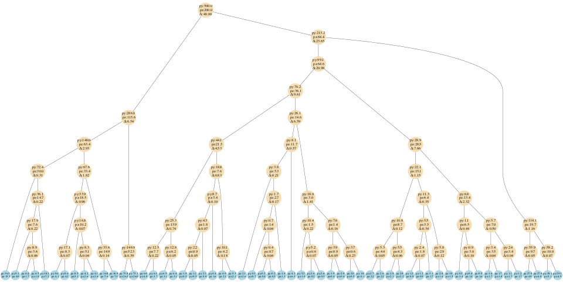
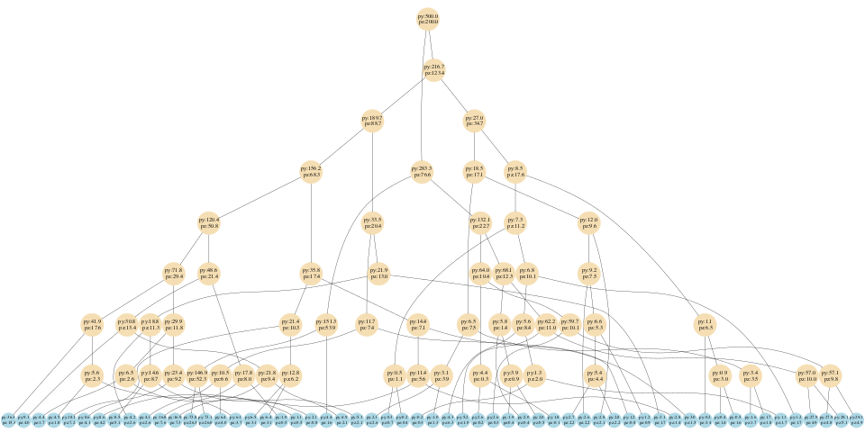
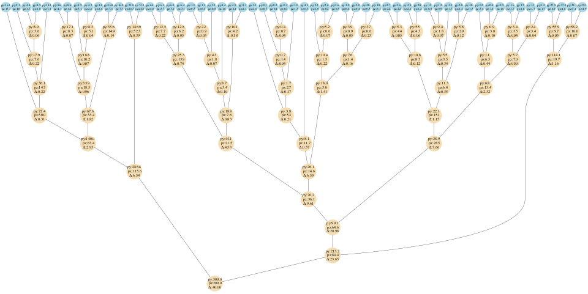
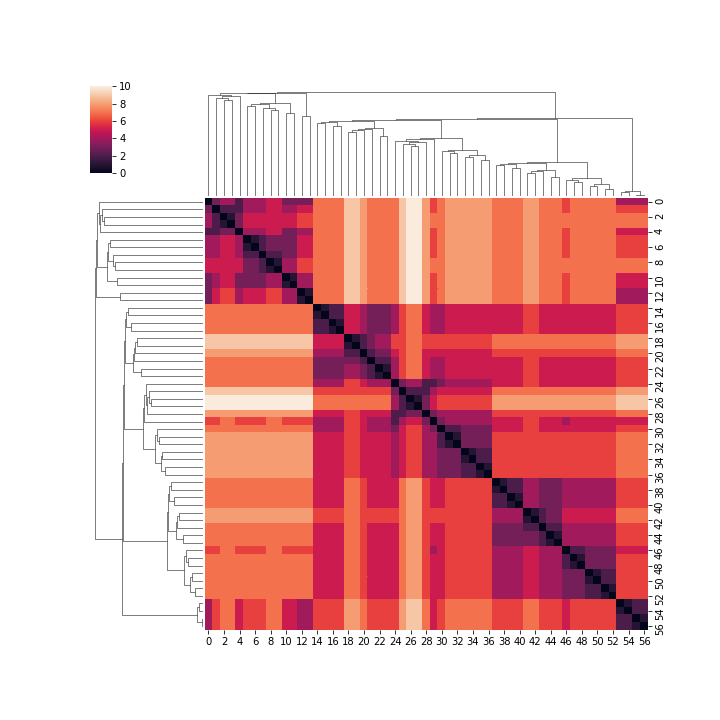
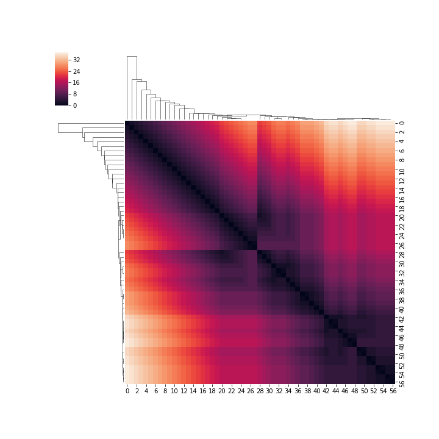
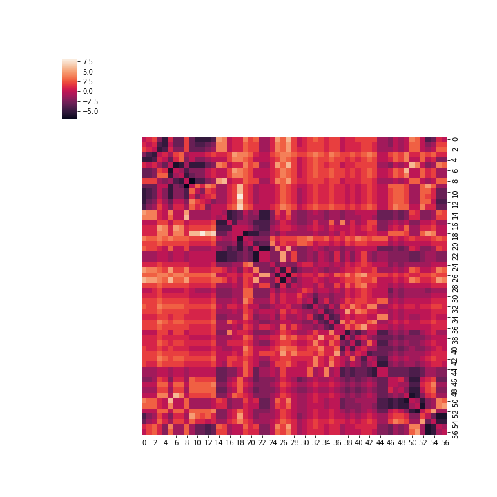

# Visualize Binary Trees

### **Kyle Cranmer, Sebastian Macaluso and Duccio Pappadopulo**

Note that this is an early development version. 

 

## Introduction

This is a visualization package for binary trees. In particular, this package allows to compare visualizations of jets generated with the [`Toy Generative Model for Jets`](https://github.com/SebastianMacaluso/ToyJetsShower) package. 

There are three main notebooks:

1) [`binaryTreeStructure`](binaryTreeStructure.ipynb): this  notebook explains the structure of the jet tree dictionaries (generated with the [`Toy Generative Model`](https://github.com/SebastianMacaluso/ToyJetsShower) ) and some examples on how to access the information contained in the dictionaries. Also, any binary tree that satisfies the structure described in this notebook, could be visualized with this package.

2) [`visualize1DTree`](visualize1DTree.ipynb): contains the *1D tree-only* jet visualizations.

3) [`visualizeClusterMap`](visualizeClusterMap.ipynb): contains the *2D heat clustermaps* visualizations of the jets.

Below, we will show different visualizations of the same jet that represents a W boson jet in the [`Toy Generative Model`](https://github.com/SebastianMacaluso/ToyJetsShower), and the different options between truth data and  {kt, CA, antikt} clustering algorithms.

## 1D Tree-only visualizations

Given a tree structure, *1D tree-only* plots of the tree (with nodes and edges) are generated in [`visualize1DTree.ipynb`](visualize1DTree.ipynb).

There are 2 functions for visualization:

a) function **plotBinaryTree**: generates a tree with nodes and edges using graphviz Digraph.

b) function **visualizeTreePair**: compares 2 trees (top/bottom) by calling the plotBinaryTree function.

There are many examples showing how to use these functions in the notebook.

Below we show different 1D Tree-only visualizations of a sample jet generated with our model that represents a W boson jet (also the same jet as in the 2D heat clustermaps visualizations section below).  We show the values of **p** =(p_y,p_z) for each node and the scale Delta for the splitting of the inner nodes (for the truth jet data).

##### Fig. 1: 1D Tree-only visualization of the truth level tree for a sample jet generated with our model. The horizontal ordering of the leaves corresponds to the order in which the leaves are accessed when traversing the truth tree (and is not related to the particle momentum **p**).

<pre>

</pre>
 
 
 ##### Fig. 2: 1D Tree-only visualization of a sample jet generated with our model that was reclustered with the anti-kt algorithm. We can see the *ladder* like structure that is typically obtained for this algorithm. The horizontal ordering of the leaves corresponds to the order in which the leaves are accessed when traversing the reclustered tree.

##### Fig. 3: 1D Tree-only comparison of a sample jet generated with our model, between the kt reclustered tree (top) and the truth tree (bottom). The horizontal ordering of the leaves corresponds to the order in which the leaves are accessed when traversing the truth tree.

## 2D heat clustermaps visualizations

Given a tree structure, 2D heat clustermaps visualizations are obtained with [`visualizeClusterMap.ipynb`](visualizeClusterMap.ipynb).
Specifically, given a jet (the set of its constituents), visualization for the different trees obtained with each clustering algorithm (and the truth tree) are displayed. 

There are 2 functions for visualization:

a) function **heat_dendrogram**: Create  a heat dendrogram clustermap. 
- 1) If only one jet is given as input, both rows and columns are ordered according to that jet tree.
- 2) If two jets are given as input:
        - If *truthJet* and *recluster_jet1*, the visualization shows the heat data map of the truth jet, with columns ordered according to the truth jet and rows according to recluster_jet1.
        - If *recluster_jet1* and *recluster_jet2*, the visualization shows the heat data map of recluster_jet2, with columns ordered according to the recluster_jet1 and rows according to recluster_jet2.

b) function **dendrogramDiff**: Given two jet algorithms heat data matrices, we reorder the heat matrices according to the truth jet order (order in which leaves are accessed when traversing the truth tree) and take the difference.

Both functions have the same arguments:
- Truth jet dictionary
- recluster_jet1: reclustered jet 1
- recluster_jet2: reclustered jet 2
- full_path: Bool. If True, then use the total number of steps to connect a pair of leaves as the heat data. If False, then given a pair of jet constituents {i,j} and the number of steps needed for each constituent to reach their closest common ancestor {S_i,S_j}, the heat map scale represents the maximum number of steps, i.e. max{S_i,S_j}.
- FigName: Dir and location to save a plot.

Usage:
- Select the *input_dir* directory with the jets dictionaries.
- Select the *Input_jet* filename for the visualizations.
- Optional: input a name and location to save an image as the *outFilename* argument of the heat_dendrogram or dendrogramDiff functions.

Note: The length of the connections among nodes for dendrogram diagrams shown at the sides of the clustermaps, is given by:
- The distance measure d_ij between nodes, for the {Kt, CA, Antikt} algorithms. 
- An integer starting at 0 and increasing by one each time a node is added, for the truth case. 

Below we show diffrent visualizations and comparisons of the same jet (also the same jet as in the 1D Tree-only visualizations section).

##### Fig. 4: Heat clustermap plot of the tree corresponding to the truth jet data (the tree generated with the [`Toy Generative Model`](https://github.com/SebastianMacaluso/ToyJetsShower))

##### Fig. 5: Heat clustermap plot of the tree after reclustering with the Anti-kt algorithm.

##### Fig. 6: Plot for the heat clustermap difference between the truth jet and the Kt reclustered one. The closer the trees substrucre is, the closer to cero the values in each entry. 

**Relevant Structure**:

- [`binaryTreeStructure`](binaryTreeStructure.ipynb): notebook that explains the structure of the jet tree dictionaries.
- [`visualize1DTree.ipynb`](visualize1DTree.ipynb): contains the *1D tree-only* jet visualizations.
- [`visualizeClusterMap.ipynb`](visualizeClusterMap.ipynb): contains the *2D heat clustermaps* of the jets.
- [`data`](data/): Dir with the jet dictionaries data.
- [`scripts`](scripts/): Dir with the code to generate the visualizations:
    - [`reclusterTree.py`](scripts/reclusterTree.py): recluster a jet following the {Kt, CA, Antikt} clustering algorithms.
    - [`Tree1D.py`](scripts/Tree1D.py):
    - [`heatClustermap.py`](scripts/heatClustermap.py)
    - [`linkageList.py`](scripts/linkageList.py): build the linkage list necessary for the 2D heatclustermaps for the truth jet data.
    

##### **Running locally as a python package:**

1. Clone the *VisualizeBinaryTrees* repository
2. `cd VisualizeBinaryTrees`
3. `make`

<pre>

</pre>

  

